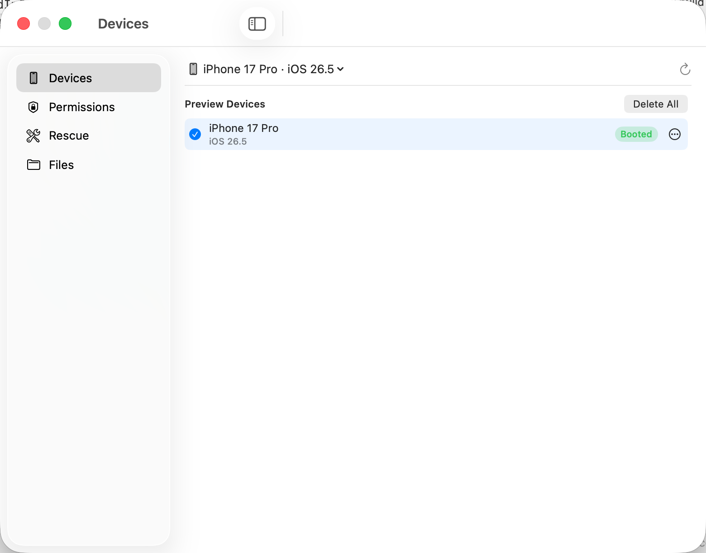
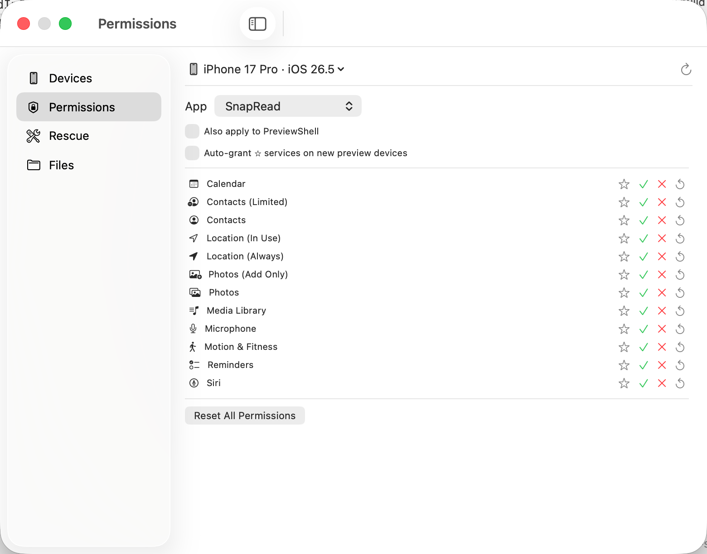
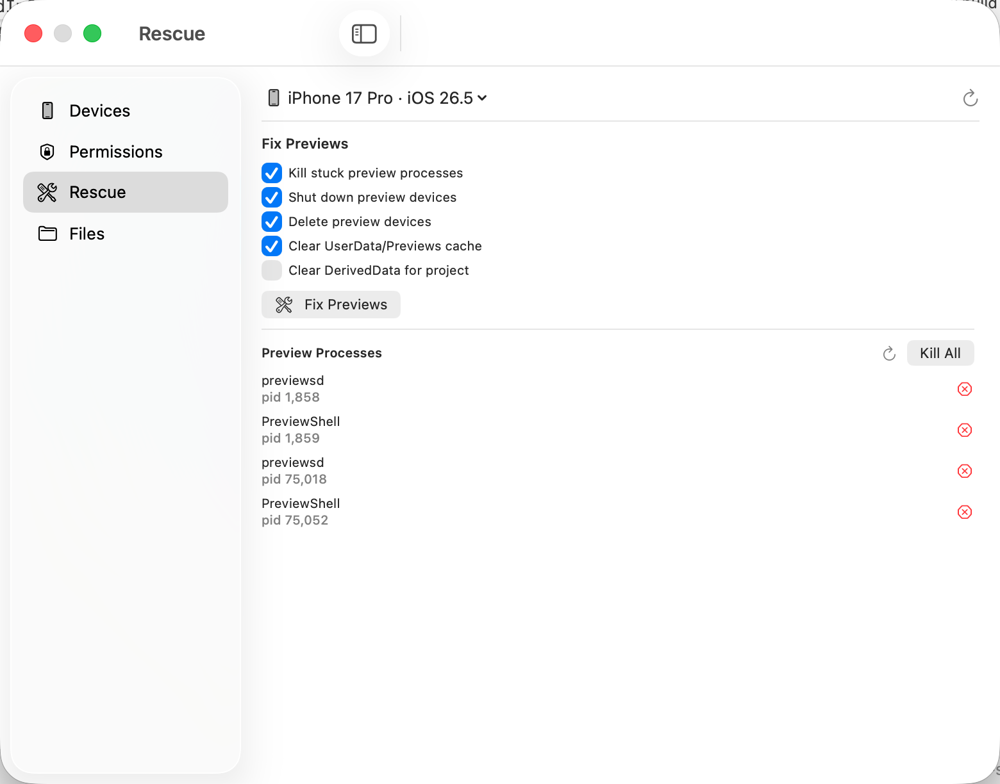
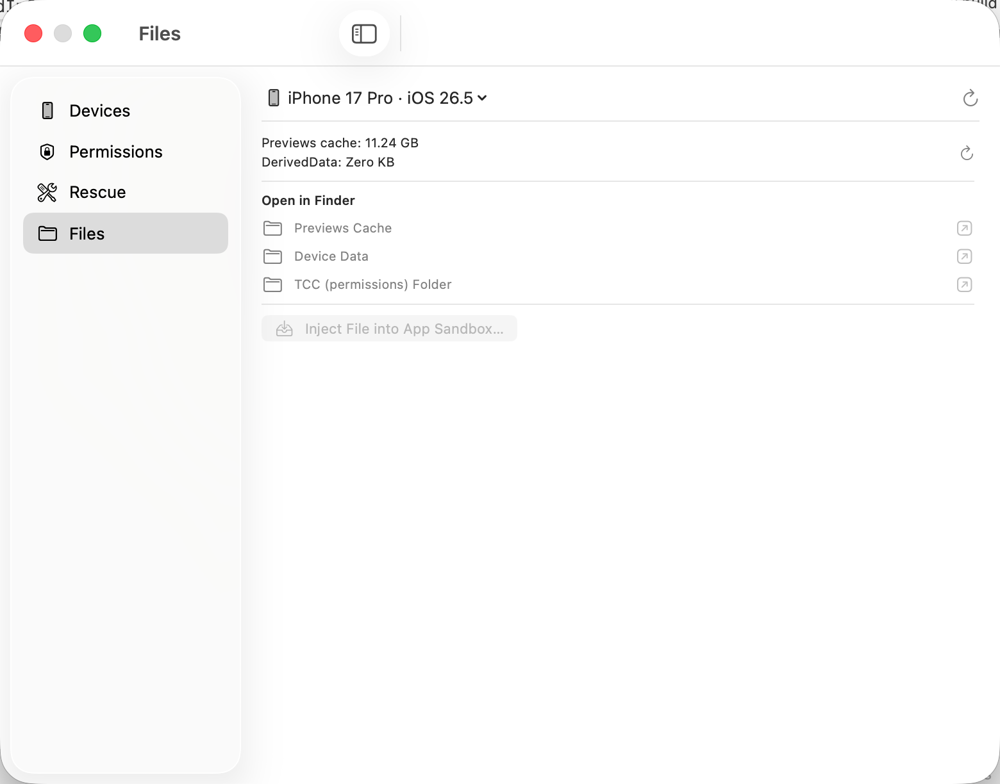

# Xcode Preview Companion

[](https://github.com/gfreezy/xcode-preview-companion/actions/workflows/ci.yml)
[](https://github.com/gfreezy/xcode-preview-companion/actions/workflows/release.yml)

A macOS menu bar app for managing the environment behind Xcode's SwiftUI Previews.

SwiftUI Previews for iOS / watchOS / tvOS run on a **separate CoreSimulator device set** (`xcrun simctl --set previews …`), isolated from the simulators you boot by hand. Existing tools (RocketSim, Control Room, SimPermissions) all operate on the default device set — so a permission you grant there never reaches your previews. Xcode Preview Companion targets that preview-only environment directly.

## Screenshots

| Devices | Permissions |
| --- | --- |
|  |  |
| **Rescue** | **Files** |
|  |  |

## Features

- **Devices** — list the preview device set, see which are booted, shut down / delete individual devices, or delete them all.
- **Permissions** — grant / revoke / reset TCC privacy services (photos, location, contacts, microphone, …) for the previewed app, optionally also for `com.apple.PreviewShell`. Star services into a per-app **auto-grant profile** that re-applies automatically whenever Xcode spins up a fresh preview device.
- **Rescue** — one-click "Fix Previews": kill stuck preview processes, shut down + delete preview devices, clear the `UserData/Previews` cache, and optionally clear a project's DerivedData. Plus a live list of preview processes you can kill individually.
- **Files** — open the Previews cache, a device's data dir, its TCC folder, or the app sandbox in Finder; see cache/DerivedData disk usage; inject a file into the previewed app's sandbox `Documents`.

## Requirements

- macOS 14+
- Xcode installed (provides `simctl`)
- [XcodeGen](https://github.com/yonaskolb/XcodeGen) to generate the project (`brew install xcodegen`)

## Install

Download the latest `XcodePreviewCompanion-*.dmg` from the [Releases](https://github.com/gfreezy/xcode-preview-companion/releases) page, open it, and drag the app to `/Applications`.

The DMG is signed with a **self-signed certificate** (not an Apple Developer ID), so it is not notarized. On first launch macOS Gatekeeper will block it — right-click the app → **Open**, then confirm. This is only needed once. A stable self-signed identity (rather than a per-build ad-hoc signature) means privacy permissions you grant the app survive across updates.

If right-click → Open still reports the app is "damaged" or can't be opened, strip the quarantine attribute Gatekeeper adds to downloaded files:

```sh
xattr -dr com.apple.quarantine /Applications/XcodePreviewCompanion.app
```

(`-d` deletes the `com.apple.quarantine` attribute, `-r` applies it recursively to the whole bundle.) Then launch the app normally.

## Build

```sh
xcodegen generate
open XcodePreviewCompanion.xcodeproj   # build & run from Xcode
```

Or from the command line:

```sh
xcodegen generate
xcodebuild -project XcodePreviewCompanion.xcodeproj \
  -scheme XcodePreviewCompanion -configuration Debug build
```

The app lives in the menu bar. Click its icon, then **Open Companion** for the full window (Devices / Permissions / Rescue / Files in a sidebar).

## How it works

- All simulator interaction goes through `xcrun simctl --set previews …`, wrapped in `SimctlClient` so a change to that (undocumented) behavior is a one-file fix.
- Granting a permission **terminates the running app**, so auto-grant is *transition-based*: the profile is re-applied only when a new booted preview device appears, never on a timer — otherwise it would kill the live preview repeatedly.
- macOS previews run locally rather than on a simulator, so they don't show up here.

## Architecture

- SwiftUI `MenuBarExtra` + an on-demand `Window` with a sidebar.
- Swift 6 with Approachable Concurrency (`SWIFT_DEFAULT_ACTOR_ISOLATION = MainActor`); subprocess/file work runs off the main actor via `@concurrent`.
- Services layer (`SimctlClient`, `ProcessManager`, `RescueService`, `PreviewPaths`, `ProfileStore`) isolates all side effects from the views.

> Uses undocumented `simctl --set previews` behavior; may need adjusting across Xcode versions.

## License

[MIT](LICENSE)
